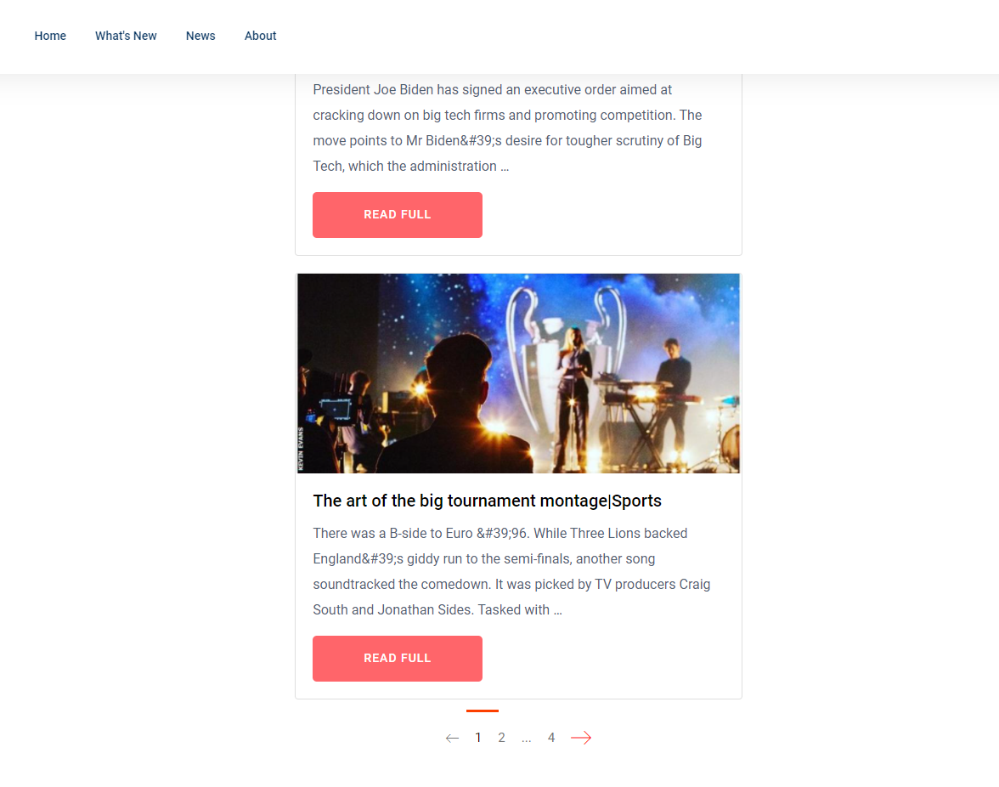

# aznews

It's commit clear version of my another repository https://github.com/Reverlight/aznews

## How to install

* Install python 3
* Create virtualenv
* Git clone https://github.com/Reverlight/aznews_project.git
* ``pip install -r requirements``
* Add your PostGreSQL credentials in settings.py (databases) 

## Optional
* Add initial news: ``python manage.py loaddata aznews_app/fixtures/data.json``

## Warning
* PostGreSQL is required!

## Admin
* Create superuser:
  ``python manage.py createsuperuser``
* Visit url root + \admin. For example http://127.0.0.1:8000/admin/
* Enter User Credentials
* Now you can edit\add news and it's categories

## Previews

